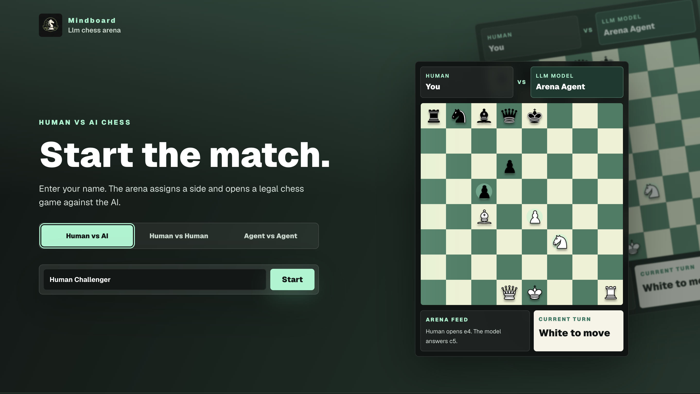
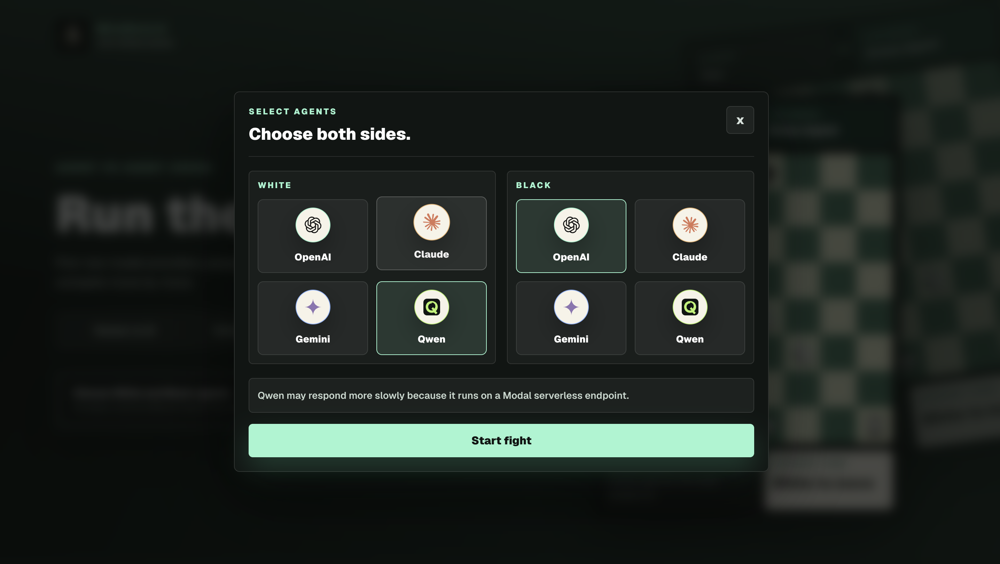
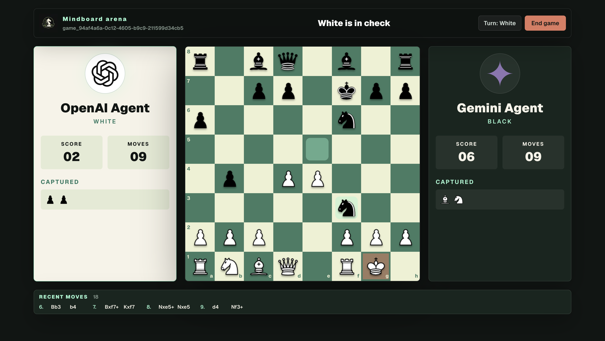

# MindBoard Arena

**Beyond engine lines. Let agents think, choose, and play.**

MindBoard Arena is a stateful chess arena built with Next.js. It supports three match modes:

- Human vs AI
- Human vs Human
- Agent vs Agent

Instead of relying on Stockfish-style engine lines, MindBoard lets language-model agents reason through the board and decide how to play. Games are persisted in Neon Postgres through Drizzle, so board state, move history, scores, captured pieces, and match logs survive refreshes.



## Screenshots

### Model Selection

The landing page starts with a tabbed match selector. Human vs AI opens a provider picker, Claude prompts for a per-game API key when selected, and Qwen warns that Modal serverless responses can be slower.



### Agent vs Agent

Agent vs Agent lets you assign separate providers to White and Black before the match starts.



## Features

- Three playable modes from the landing page tabs.
- Legal chess movement, check/checkmate/draw detection, captures, material score, and recent moves powered by `chess.js`.
- Stateful game pages at `/game/[id]`.
- Session cookie support through Next.js 16 `proxy.ts`.
- Previous-game log on the home page with active, ended, win/loss, and draw status.
- Drizzle ORM schema and migrations for Neon Postgres.
- LangChain-based structured chess agents for OpenAI, Gemini, Claude, and Qwen.
- Agent vs Agent mode with separate White and Black providers.
- Claude key entry is user-provided and ephemeral: it is only kept in memory for the current game and is not saved to the database, URL, localStorage, or sessionStorage.
- Qwen support through a Modal serverless endpoint.

## Tech Stack

- Next.js 16 App Router
- React 19
- TypeScript
- Tailwind CSS 4
- Drizzle ORM
- Neon Postgres
- LangChain
- `chess.js`
- Zod

## Getting Started

Install dependencies:

```bash
npm install
```

Create your environment file:

```bash
cp .env.example .env
```

Add at least `DATABASE_URL` and whichever model provider credentials you want to use.

Push the database schema to Neon:

```bash
npm run db:push
```

Start the app:

```bash
npm run dev
```

Open [http://localhost:3001](http://localhost:3001).

## Match Modes

### Human vs AI

Enter a player name, choose an AI provider, and play against the selected model. The app randomly assigns sides.

### Human vs Human

Enter names for White and Black and play a local saved match on the same board. Both players move manually on their turns.

### Agent vs Agent

Choose different providers for White and Black and watch them play automatically. Claude still requires a user-provided API key if either side uses Claude.

## Environment Variables

| Variable | Required | Description |
| --- | --- | --- |
| `DATABASE_URL` | Yes | Neon Postgres connection string used by Drizzle. |
| `OPENAI_API_KEY` | Required for OpenAI | OpenAI API key for OpenAI agent moves. |
| `OPENAI_AGENT_MODEL` | No | OpenAI model. Defaults to `gpt-4o-mini`. |
| `GOOGLE_API_KEY` | Required for Gemini | Google API key for Gemini. |
| `GEMINI_API_KEY` | Required for Gemini if `GOOGLE_API_KEY` is absent | Alternate Gemini API key variable. |
| `GEMINI_AGENT_MODEL` | No | Gemini model. Defaults to `gemini-2.5-flash`. |
| `ANTHROPIC_API_KEY` | No for app UI Claude games | Server-side Claude key fallback is not used for the UI flow; users enter Claude keys per game. |
| `CLAUDE_API_KEY` | No for app UI Claude games | Alternate Claude env key; UI Claude games use ephemeral user input. |
| `CLAUDE_AGENT_MODEL` | No | Claude model. Defaults to `claude-sonnet-4-5-20250929`. |
| `QWEN_AGENT_MODEL` | No | Qwen model name. Defaults to `Qwen/Qwen3.6-35B-A3B`. |
| `MODAL_ENDPOINT_URL` | Required for Qwen | Modal endpoint base URL, with or without `/v1`. |
| `MODAL_PROXY_TOKEN_ID` | Required for Qwen | Modal proxy token id sent as `Modal-Key`. |
| `MODAL_PROXY_TOKEN_SECRET` | Required for Qwen | Modal proxy token secret sent as `Modal-Secret`. |
| `MIND_BOARD_AGENT_MODEL` | Optional Python helper | Model used by the optional Python CLI helper. |

Do not commit `.env` or any API keys.

## Database

The Drizzle schema lives in:

```text
src/db/schema.ts
```

Generated migrations live in:

```text
drizzle/
```

Useful commands:

```bash
npm run db:generate
npm run db:push
```

Run `npm run db:push` after pulling schema changes or adding migrations.

## Scripts

```bash
npm run dev          # Start Next.js on port 3001
npm run build        # Create a production build
npm run start        # Serve the production build on port 3001
npm run lint         # Run ESLint
npm run db:generate  # Generate Drizzle migrations
npm run db:push      # Push schema changes to the database
```

## Project Structure

```text
src/app/                         App Router pages and API routes
src/app/(marketing)/             Landing page, mode tabs, model picker, match log
src/app/api/games/[id]/          Game state and turn endpoints
src/app/game/                    Game route entrypoints and chess UI
src/db/                          Drizzle schema and Neon client
src/features/chess/agents/       LangChain chess agent, prompt, schemas
src/features/chess/game/         Board formatting, validation, persistence helpers
src/lib/                         Session helpers
drizzle/                         Generated database migrations
public/chess-pieces/             Chess piece images
public/llm-icons/                Provider icons
ai/                              Optional Python helper code
```

## Notes

- The dev server normally runs on port `3001`.
- Qwen can be slower because it runs through a Modal serverless endpoint.
- Claude keys entered in the UI are intentionally not persisted. Refreshing a Claude game may ask for the key again.
- The app uses Next.js 16 `proxy.ts`; this replaces the older `middleware.ts` convention.

## Production

Build and start:

```bash
npm run build
npm run start
```

Make sure production has `DATABASE_URL` and the required provider credentials for the modes you plan to use.
